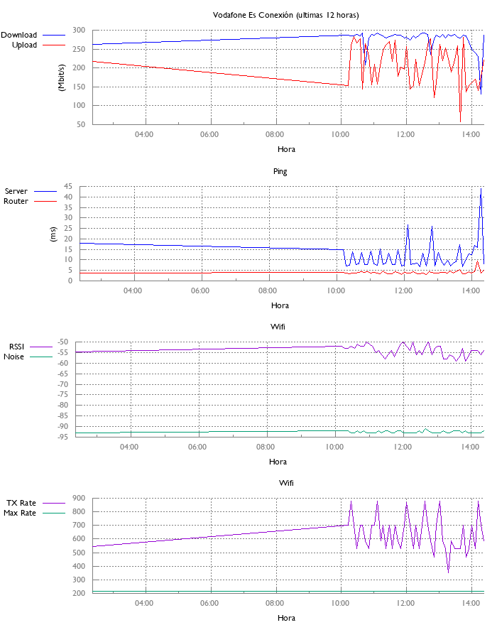

Mac OSX ONLY!!!!



# Installation

- Install [brew](https://brew.sh/)
- Install `git` (`brew install git`)
- Install `gnuplot` (`brew install gnuplot`)
- Install `python` (`brew install python`)
- Install `virtualenv` (`pip install virtualenv`)
- Create a twitter [app](https://apps.twitter.com/), doesn't matter what you call it as long as you generate and make: <br>`CONSUMER_KEY` `CONSUMER_SECRET` `ACCESS_TOKEN_KEY` `ACCESS_TOKEN_SECRET`

```
virtualenv venv && \
venv/bin/pip install twitterapi && \
printf "Please enter CONSUMER_KEY: " && read CONSUMER_KEY && \
printf "Please enter CONSUMER_SECRET: " && read CONSUMER_SECRET && \
printf "Please enter ACCESS_TOKEN_KEY: " && read ACCESS_TOKEN_KEY && \
printf "Please enter ACCESS_TOKEN_SECRET: " && read ACCESS_TOKEN_SECRET && \
printf "\n\nexport CONSUMER_KEY=$CONSUMER_KEY\nexport CONSUMER_SECRET=$CONSUMER_SECRET\nexport ACCESS_TOKEN_KEY=$ACCESS_TOKEN_KEY\nexport ACCESS_TOKEN_SECRET=$ACCESS_TOKEN_SECRET\n" >> venv/bin/activate
```

# Run to annoy

```
source venv/bin/activate;
while true; do
  # get my wireless info (agrCtlRSSI agrExtRSSI agrCtlNoise agrExtNoise state opmode lastTxRate maxRate lastAssocStatus 802.11auth linkauth BSSID SSID MCS channel)
  wifi_info=$(/System/Library/PrivateFrameworks/Apple80211.framework/Versions/Current/Resources/airport -I | sed 's/: /|/' | tr -ds ' ' '' | cut -d '|' -f 2 | paste -sd " " -)
  agrCtlRSSI=$(echo $wifi_info | cut -d ' ' -f 1)
  agrExtRSSI=$(echo $wifi_info | cut -d ' ' -f 2)
  agrCtlNoise=$(echo $wifi_info | cut -d ' ' -f 3)
  agrExtNoise=$(echo $wifi_info | cut -d ' ' -f 4)
  state=$(echo $wifi_info | cut -d ' ' -f 5)
  opmode=$(echo $wifi_info | cut -d ' ' -f 6)
  lastTxRate=$(echo $wifi_info | cut -d ' ' -f 7)
  maxRate=$(echo $wifi_info | cut -d ' ' -f 8)
  lastAssocStatus=$(echo $wifi_info | cut -d ' ' -f 9)
  eightonetwoauth=$(echo $wifi_info | cut -d ' ' -f 10)
  linkauth=$(echo $wifi_info | cut -d ' ' -f 11)
  BSSID=$(echo $wifi_info | cut -d ' ' -f 12)
  SSID=$(echo $wifi_info | cut -d ' ' -f 13)
  MCS=$(echo $wifi_info | cut -d ' ' -f 14)
  channel=$(echo $wifi_info | cut -d ' ' -f 15)
  # get my vodafone router ping average
  router_ping_avg=$(ping -c4 $(netstat -nr | grep '^default' | grep UGSc | tr -ds '\t' ' ' | cut -d ' ' -f 2) | tail -n 1 | cut -d '=' -f 2 | cut -d '/' -f 2)
  # save the speedtest data and append the wifi name and router ping -- also convert the time to local time
  speedtest-cli --csv | awk '{print $0",'$SSID','$router_ping_avg','$agrCtlRSSI','$agrExtRSSI','$agrCtlNoise','$agrExtNoise','$lastTxRate','$maxRate'"}' | python <(cat <<EOF
import sys, csv, datetime, re

writer = csv.writer(sys.stdout)
for line in csv.reader(sys.stdin):
    date = re.split("[^\d]", line[3])[:-1]
    if not date:
        continue

    line[3] = (datetime.datetime(*map(int, date)) + datetime.timedelta(hours=2)).strftime('%Y-%m-%dT%H:%M')
    writer.writerow(line)
EOF
) >> $(pwd)/vodafone.csv;

  gnuplot <(cat <<EOF
    set grid
    set terminal png size 700,880 font 'Gill Sans,9' rounded
    set output '$(pwd)/graph.png'
    set style line 11 lc rgb '#808080' lt 1
    set border 3 back ls 11
    set tics nomirror
    set style line 12 lc rgb '#808080' lt 0 lw 1
    set grid back ls 12

    set key out vert
    set key top left

    set multiplot layout 4, 1;
    set title 'Vodafone Es Conexión (ultimas 12 horas)'
    set ylabel '(Mbit/s)'
    set xdata time
    set xlabel 'Hora'
    set format x '%H:%M'
    set timefmt '%Y-%m-%dT%H:%M'
    set xrange ['$(python -c 'import datetime; print (datetime.datetime.now() - datetime.timedelta(hours=12)).strftime("%Y-%m-%dT%H:%M")')' : '$(python -c 'import datetime; print datetime.datetime.now().strftime("%Y-%m-%dT%H:%M")')']
    set datafile separator ','
    plot '$(pwd)/vodafone.csv' using 4:(\$7/1000000) title 'Download' with lines linetype rgb 'blue',\\
         '$(pwd)/vodafone.csv' using 4:(\$8/1000000) title 'Upload' with lines linetype rgb 'red'
    set title 'Ping';
    set ylabel '(ms)'
    plot '$(pwd)/vodafone.csv' using 4:6 title 'Server' with lines linetype rgb 'blue',\\
         '$(pwd)/vodafone.csv' using 4:10 title 'Router' with lines linetype rgb 'red'
     set title 'Wifi';
     set ylabel ''
     plot '$(pwd)/vodafone.csv' using 4:11 title 'RSSI' with lines,\\
          '$(pwd)/vodafone.csv' using 4:13 title 'Noise' with lines
      plot '$(pwd)/vodafone.csv' using 4:15 title 'TX Rate' with lines,\\
           '$(pwd)/vodafone.csv' using 4:16 title 'Max Rate' with lines
EOF
  );

  # save the new data
  git -C $(pwd) add $(pwd)/vodafone.csv
  git -C $(pwd) add $(pwd)/graph.png
  git -C $(pwd) commit -m "New data $(date '+%Y-%m-%d %H:%M:%S')"
  git -C $(pwd) push

  # figure out if vodafone needs to be annoyed
  python annoy_on_twitter.py

  sleep 300; # wait 5 mins and do it again
done
```
