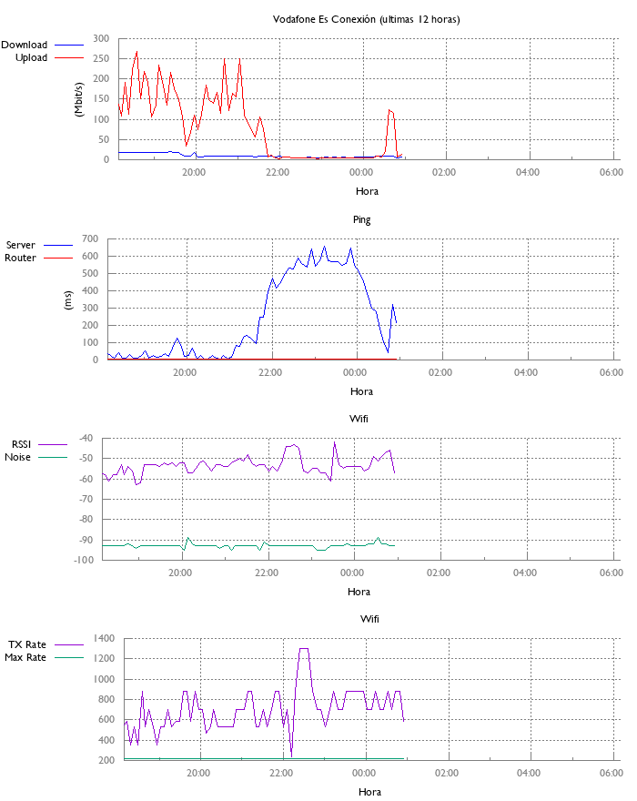

Mac OSX ONLY!!!!



# Installation

- Install [brew](https://brew.sh/)
- Install `git` (`brew install git`)
- Install `gnuplot` (`brew install gnuplot`)
- Install `python` (`brew install python`)
- Install `virtualenv` (`pip install virtualenv`)
- Create a twitter [app](https://apps.twitter.com/), doesn't matter what you call it as long as you generate and make: <br>`CONSUMER_KEY` `CONSUMER_SECRET` `ACCESS_TOKEN_KEY` `ACCESS_TOKEN_SECRET`

```
virtualenv venv && \
venv/bin/pip install twitterapi && \
printf "Please enter CONSUMER_KEY: " && read CONSUMER_KEY && \
printf "Please enter CONSUMER_SECRET: " && read CONSUMER_SECRET && \
printf "Please enter ACCESS_TOKEN_KEY: " && read ACCESS_TOKEN_KEY && \
printf "Please enter ACCESS_TOKEN_SECRET: " && read ACCESS_TOKEN_SECRET && \
printf "\n\nexport CONSUMER_KEY=$CONSUMER_KEY\nexport CONSUMER_SECRET=$CONSUMER_SECRET\nexport ACCESS_TOKEN_KEY=$ACCESS_TOKEN_KEY\nexport ACCESS_TOKEN_SECRET=$ACCESS_TOKEN_SECRET\n" >> venv/bin/activate
```

# Run to annoy

```
source venv/bin/activate;
while true; do
  # get my current wireless name
  wifi_name=$(/Sy*/L*/Priv*/Apple8*/V*/C*/R*/airport -I | grep SSID | grep -v BSSID | tr -d ' ' | cut -d ':' -f 2)
  # get my vodafone router ping average
  router_ping_avg=$(ping -c4 $(netstat -nr | grep '^default' | grep UGSc | tr -ds '\t' ' ' | cut -d ' ' -f 2) | tail -n 1 | cut -d '=' -f 2 | cut -d '/' -f 2)
  # save the speedtest data and append the wifi name and router ping
  speedtest-cli --csv | awk '{print $0",'$wifi_name','$router_ping_avg'"}' >> $(pwd)/vodafone.csv;

  gnuplot <(echo "
    set grid
    set terminal png size 700,480 font 'Gill Sans,9' rounded
    set output '$(pwd)/graph.png'
    set style line 11 lc rgb '#808080' lt 1
    set border 3 back ls 11
    set tics nomirror
    set style line 12 lc rgb '#808080' lt 0 lw 1
    set grid back ls 12

    set key out vert
    set key top left

    set multiplot layout 2, 1 ;
    set title 'Vodafone Es Conexión (ultimas 12 horas)'
    set ylabel '(Mbit/s)'
    set xlabel 'Hora'
    set xdata time
    set xrange [time(0) - 43200 : time(0)]
    set format x '%H:%M'
    set timefmt '%Y-%m-%dT%H:%M:%SZ'
    set datafile separator ','
    plot '$(pwd)/vodafone.csv' using 4:(\$7/1000000) title 'Download' with lines linetype rgb 'blue',\
         '$(pwd)/vodafone.csv' using 4:(\$8/1000000) title 'Upload' with lines linetype rgb 'red'
    set title 'Ping';
    set ylabel '(ms)'
    plot '$(pwd)/vodafone.csv' using 4:6 title 'Server' with lines linetype rgb 'blue',\
         '$(pwd)/vodafone.csv' using 4:10 title 'Router' with lines linetype rgb 'red'
  ");

  # save the new data
  git -C $(pwd) add $(pwd)/vodafone.csv
  git -C $(pwd) add $(pwd)/graph.png
  git -C $(pwd) commit -m "New data $(date '+%Y-%m-%d %H:%M:%S')"
  git -C $(pwd) push

  # figure out if vodafone needs to be annoyed
  python annoy_on_twitter.py

  sleep 300; # wait 5 mins and do it again
done
```
